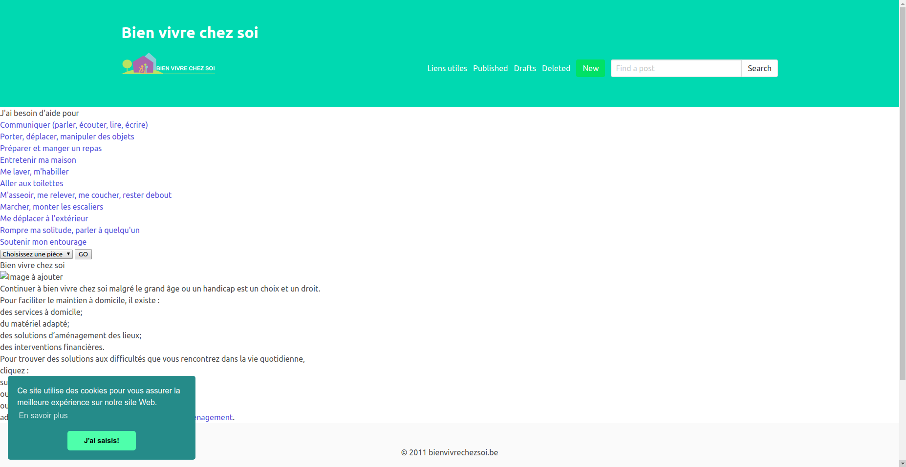
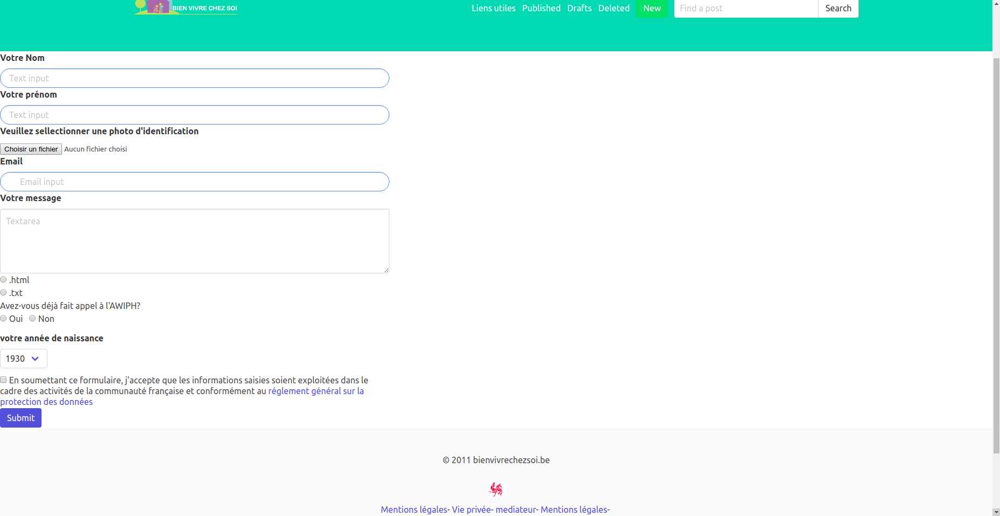
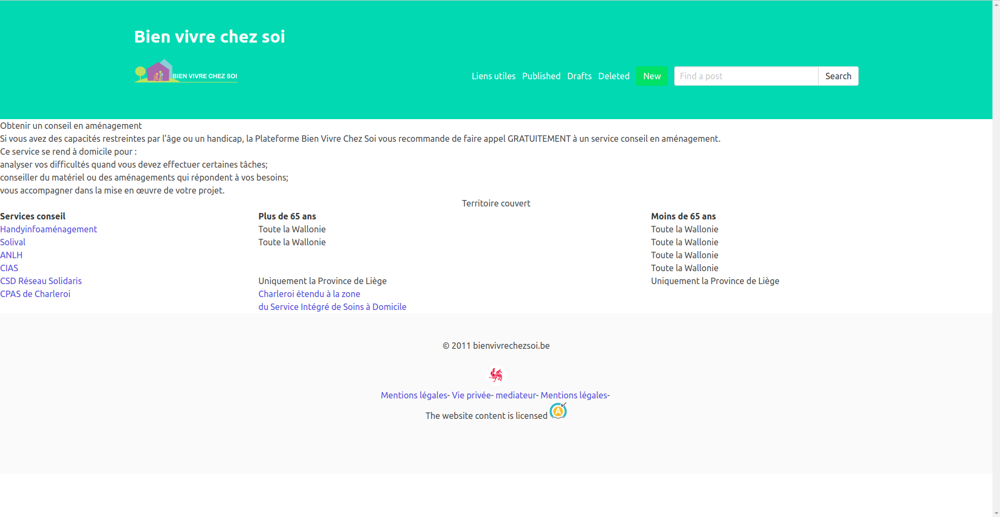
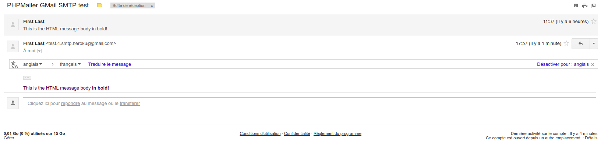

# Fil Rouge Multipage Website : Bien vivre chez soi

## Équipe de développement :
* **Tahri Mostapha :** Project manager + Développeur Full-Stack.
* **Carlier Liam :** Développeur Full-Stack.

## Objectif :
Création d'un site **multipage** intégrant un **formulaire de contact** fonctionnel (upload d'images + envoi d'emails).

Les consignes sont regroupé dans [ce repo](https://github.com/becodeorg/lovelace-2/tree/master/Projects/multipage-website-in-php).

Vous pouvez également consulter le site en ligne [ici](https://bienvivrechezsoi.herokuapp.com).

## ScreenShots :

## Planning :
| Dates | Description | Fait? |
| ----- | ----------- | ----- |
| 30/07/2018   | **Premier meeting** : Organisation du projet et attributions des tâches.|Fait|
| 31/07/2018 | **Objectif** : Créer un squelette de chacunes des pages en HTML/PHP|Presque fait. Il manque le footer(Liam).|
| 01/08/2018 | **Objectif** : Rendre les pages dynamiques et interractives avec AJAX + PHP (Mostapha) & envoi de mails avec PHPMailer (Liam) |(Mostapha) Fait[07/08/2018] / (Liam) en attente|
|02/08/2018 - 06/08/2018| **Hackathon** : Hack in the woods. | / |
|09/08/2018| **Objectif** : Déploiement du site web avec Heroku + Ajout des mentions GDPR| Heroku : Fait / GDPR : Fait|
|10/08/2018| Fin du Challenge.   **Objectif** : Terminer le reste des implémentations, à savoir :   * Ajouter l'upload d'image à l'envoi de mail   * Ajouter la page form-log.php   * Rendre l'application PWA   * Améliorer le score sur le lighthouse | En attente|

## Librairies utilisées :
* **CSS** : Bulma
* **Mail** : PHPMailer
* **Mise en ligne** : Heroku/Composer
* **Cookie** : Cookie Consent
* **PWA** : Chrome

## Commentaires développeurs
* (Pour consulter les pages [contact](https://bienvivrechezsoi.herokuapp.com/contact.php) et [conseils](https://bienvivrechezsoi.herokuapp.com/conseils.php), veuillez suivre ces liens.)
* PHPMailer est implémenté, mais pas "bindé" avec le formulaire de contact. Vous pouvez malgré tout voir qu'il est bien implémenté grâce à l'output fourni par [ce lien](https://bienvivrechezsoi.herokuapp.com/mailer.php).

 **Snaps du message reçu sur la boite Gmail :**
 
